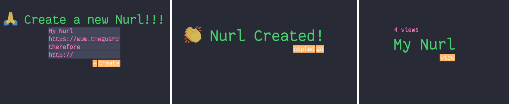

# NURL



Nurl is a url combiner for N-amount of urls.
Main goal is to practise with Rust in web development. Heavily based on [zero2prod](https://www.zero2prod.com/index.html)

# Concept

Nurl allows combining multiple urls and/or sentiments in one url. Url can be any valid webpage. A sentiment is word or sentence which can give context to the urls.
Examples:

- `URl1`, `because`, `URL2` `therefore`, `URL3`
- `I'm happy because`, `URL`
- `⚠️ viewer discretion` , `URL1`, `URL2`

# Try it locally

```bash
./scripts/init_db
cargo run
```

Then goto [http://localhost:8000/](http://localhost:8000/)

Nurl will open a lot tabs so your browser will probably block it at first. Make to allow pop-ups in your browser.

# Extra

The server output is formatted in json. To have a readable output you need bunyan,

```bash
cargo install bunyan
cargo run | bunyan
```

There are also tests.

```bash
cargo run test
```
